# Diagram Architektury UI - Moduł Autentykacji

## Przegląd

Ten diagram przedstawia architekturę interfejsu użytkownika aplikacji SittingPlanner po wdrożeniu systemu autentykacji zgodnie z wymaganiami US-003. Diagram ilustruje:

- Nowe strony autentykacji (register, login, forgot-password, reset-password)
- Zaktualizowany komponent TopNav z obsługą stanów zalogowany/niezalogowany
- Chronione strony aplikacji z mechanizmem sprawdzania autentykacji
- Przepływ danych między komponentami Astro, komponentami React i API
- Integrację z Supabase Auth przez middleware i serwisy

## Legenda

- **Prostokąty** - Strony Astro i komponenty
- **Zaokrąglone prostokąty** - Serwisy i middleware
- **Romby** - Punkty decyzyjne
- **Linie ciągłe** - Przepływ danych/renderowania
- **Linie kropkowane** - Wywołania API
- **Grube linie** - Główne ścieżki przepływu

## Diagram

```mermaid
flowchart TD
    %% Definicje stylów
    classDef newComponent fill:#a8dadc,stroke:#457b9d,stroke-width:3px
    classDef updatedComponent fill:#f1faee,stroke:#e63946,stroke-width:2px
    classDef existingComponent fill:#fff,stroke:#333,stroke-width:1px
    classDef protectedPage fill:#ffd6a5,stroke:#ff6b35,stroke-width:2px
    classDef apiEndpoint fill:#caffbf,stroke:#06d6a0,stroke-width:2px
    classDef service fill:#ffc6ff,stroke:#9d4edd,stroke-width:2px

    %% Główny punkt wejścia
    User[("Użytkownik")]

    %% Warstwa Layouts
    subgraph Layouts["🎨 Warstwa Layouts"]
        LayoutBase["Layout.astro<br/>(Bazowy layout)"]:::existingComponent
        AppShell["AppShell.astro<br/>(Layout z nawigacją)"]:::existingComponent
        TopNav["TopNav.astro<br/>(ZAKTUALIZOWANY)<br/>Stan auth/non-auth"]:::updatedComponent
    end

    %% Moduł Autentykacji - Strony
    subgraph AuthModule["🔐 Moduł Autentykacji - Strony"]
        LoginPage["auth/login.astro<br/>(ZAKTUALIZOWANA)<br/>Formularz + linki"]:::updatedComponent
        RegisterPage["auth/register.astro<br/>(NOWA)<br/>Email + Password + Confirmation"]:::newComponent
        ForgotPage["auth/forgot-password.astro<br/>(NOWA)<br/>Formularz email"]:::newComponent
        ResetPage["auth/reset-password.astro<br/>(NOWA)<br/>Nowe hasło + token"]:::newComponent
    end

    %% Strona główna
    IndexPage["index.astro<br/>(ZAKTUALIZOWANA)<br/>Sprawdza auth"]:::updatedComponent
    WelcomeComp["Welcome.astro<br/>Komponenty CTA"]:::existingComponent

    %% Chronione strony
    subgraph ProtectedPages["🔒 Chronione Strony Aplikacji"]
        DashboardPage["dashboard.astro<br/>(Chroniona)<br/>Lista wydarzeń"]:::protectedPage
        EventsIndex["events/index.astro<br/>(Chroniona)"]:::protectedPage
        EventCreate["events/create.astro<br/>(Chroniona)"]:::protectedPage
        EventGuests["events/[id]/guests.astro<br/>(Chroniona)"]:::protectedPage
        EventTables["events/[id]/tables.astro<br/>(Chroniona)"]:::protectedPage
        EventPlan["events/[id]/plan.astro<br/>(Chroniona)"]:::protectedPage
        AccountPage["account.astro<br/>(Chroniona)"]:::protectedPage
        TemplatesPage["templates.astro<br/>(Chroniona)"]:::protectedPage
    end

    %% Komponenty React
    subgraph ReactComponents["⚛️ Komponenty React - SeatingPlan"]
        SeatingProvider["SeatingPlanPageWithProvider.tsx<br/>(React Query Provider)"]:::existingComponent
        SeatingPage["SeatingPlanPage.tsx<br/>(Główny komponent)"]:::existingComponent
        DragDrop["DragAndDropCanvas.tsx"]:::existingComponent
        PlanToolbar["PlanToolbar.tsx"]:::existingComponent
        PlanSummary["PlanSummary.tsx"]:::existingComponent
        TableComp["TableComponent.tsx"]:::existingComponent
        GuestCard["GuestCard.tsx"]:::existingComponent
    end

    %% API Endpoints - Auth
    subgraph AuthAPI["🌐 API Endpoints - Autentykacja"]
        LoginAPI["POST /api/auth/login<br/>(Istniejący)"]:::apiEndpoint
        RegisterAPI["POST /api/auth/register<br/>(Istniejący)"]:::apiEndpoint
        LogoutAPI["POST /api/auth/logout<br/>(Istniejący)"]:::apiEndpoint
        ForgotAPI["POST /api/auth/forgot-password<br/>(NOWY)"]:::newComponent
        ResetAPI["POST /api/auth/reset-password<br/>(NOWY)"]:::newComponent
    end

    %% Middleware i Serwisy
    subgraph Backend["⚙️ Backend - Middleware i Serwisy"]
        MiddlewareMain["middleware/index.ts<br/>(Wstrzykuje Supabase)"]:::service
        MiddlewareAuth["middleware/auth.ts<br/>authenticate helper"]:::service
        AuthService["AuthService<br/>login, register, logout<br/>resetPassword (NOWY)"]:::service
        SupabaseAuth["Supabase Auth<br/>signUp, signIn, signOut<br/>resetPassword, updateUser"]:::service
    end

    %% Punkty decyzyjne
    AuthCheck{"Sprawdzenie<br/>autentykacji"}
    IsAuth{"Czy<br/>zalogowany?"}
    IsAuthIndex{"Czy<br/>zalogowany?"}

    %% Przepływy główne
    User --> IndexPage
    User --> LoginPage
    User --> RegisterPage
    User --> DashboardPage
    User --> EventPlan

    %% Index page flow
    IndexPage --> IsAuthIndex
    IsAuthIndex -->|Tak| DashboardPage
    IsAuthIndex -->|Nie| WelcomeComp
    IndexPage --> LayoutBase
    LayoutBase --> WelcomeComp

    %% Auth pages flow
    LoginPage --> AppShell
    RegisterPage --> AppShell
    ForgotPage --> AppShell
    ResetPage --> AppShell
    AppShell --> TopNav

    %% Protected pages flow
    DashboardPage --> AuthCheck
    EventsIndex --> AuthCheck
    EventCreate --> AuthCheck
    EventGuests --> AuthCheck
    EventTables --> AuthCheck
    EventPlan --> AuthCheck
    AccountPage --> AuthCheck
    TemplatesPage --> AuthCheck

    AuthCheck --> IsAuth
    IsAuth -->|Tak| AppShell
    IsAuth -->|Nie| LoginPage

    %% React components in EventPlan
    EventPlan --> SeatingProvider
    SeatingProvider --> SeatingPage
    SeatingPage --> DragDrop
    SeatingPage --> PlanToolbar
    SeatingPage --> PlanSummary
    DragDrop --> TableComp
    DragDrop --> GuestCard

    %% API calls from auth pages
    LoginPage -.->|"Inline script<br/>fetch POST"| LoginAPI
    RegisterPage -.->|"Inline script<br/>fetch POST"| RegisterAPI
    ForgotPage -.->|"Inline script<br/>fetch POST"| ForgotAPI
    ResetPage -.->|"Inline script<br/>fetch POST"| ResetAPI
    TopNav -.->|"Logout click<br/>fetch POST"| LogoutAPI

    %% API to Services
    LoginAPI --> AuthService
    RegisterAPI --> AuthService
    LogoutAPI --> AuthService
    ForgotAPI --> AuthService
    ResetAPI --> AuthService

    %% Services to Supabase
    AuthService ==>|"signInWithPassword<br/>signUp<br/>signOut<br/>resetPassword<br/>updateUser"| SupabaseAuth

    %% Middleware flow
    MiddlewareMain -->|"Wstrzykuje<br/>supabase client"| LoginAPI
    MiddlewareMain -->|"Wstrzykuje<br/>supabase client"| RegisterAPI
    MiddlewareMain -->|"Wstrzykuje<br/>supabase client"| LogoutAPI
    MiddlewareMain -->|"Wstrzykuje<br/>supabase client"| ForgotAPI
    MiddlewareMain -->|"Wstrzykuje<br/>supabase client"| ResetAPI

    AuthCheck --> MiddlewareAuth
    MiddlewareAuth -->|"authenticate()<br/>sprawdza sesję"| SupabaseAuth

    %% Response flows
    LoginAPI -.->|"user + session<br/>200 OK"| LoginPage
    RegisterAPI -.->|"user + session<br/>201 Created"| RegisterPage
    LogoutAPI -.->|"success<br/>200 OK"| TopNav
    ForgotAPI -.->|"success message<br/>200 OK"| ForgotPage
    ResetAPI -.->|"success<br/>200 OK"| ResetPage

    LoginPage -->|"Przekierowanie<br/>po sukcesie"| DashboardPage
    RegisterPage -->|"Przekierowanie<br/>po sukcesie"| DashboardPage
    ResetPage -->|"Przekierowanie<br/>po sukcesie"| LoginPage
    TopNav -->|"Przekierowanie<br/>po logout"| LoginPage

    %% TopNav states
    TopNav -->|"Stan zalogowany:<br/>User menu + Dashboard"| DashboardPage
    TopNav -->|"Stan niezalogowany:<br/>Sign In + Sign Up"| LoginPage

    %% Linki między stronami auth
    LoginPage -.->|"Link:<br/>Forgot Password?"| ForgotPage
    LoginPage -.->|"Link:<br/>Don't have account?"| RegisterPage
    RegisterPage -.->|"Link:<br/>Already have account?"| LoginPage
    ForgotPage -.->|"Link:<br/>Back to Login"| LoginPage

    %% Notatki
    Note1["📝 NOWE ELEMENTY:<br/>- 3 nowe strony auth<br/>- 2 nowe API endpoints<br/>- TopNav z dwoma stanami"]:::newComponent
    Note2["📝 ZAKTUALIZOWANE:<br/>- login.astro (linki)<br/>- TopNav (conditional render)<br/>- index.astro (auth check)<br/>- AuthService (resetPassword)"]:::updatedComponent
    Note3["📝 CHRONIONE:<br/>Wszystkie strony aplikacji<br/>wymagają autentykacji<br/>przed renderowaniem"]:::protectedPage
```

## Opis Przepływów

### 1. Przepływ Rejestracji Użytkownika
1. Użytkownik → `/auth/register` (NOWA strona)
2. Wypełnia formularz (email, password, confirmation)
3. Inline script → `POST /api/auth/register`
4. API → `AuthService.register()` → `Supabase.signUp()`
5. Supabase zwraca user + session
6. Przekierowanie → `/dashboard`

### 2. Przepływ Logowania
1. Użytkownik → `/auth/login` (ZAKTUALIZOWANA)
2. Wypełnia formularz (email, password)
3. Inline script → `POST /api/auth/login`
4. API → `AuthService.login()` → `Supabase.signInWithPassword()`
5. Supabase zwraca user + session
6. Przekierowanie → `/dashboard` lub zapisany URL

### 3. Przepływ Odzyskiwania Hasła
1. Użytkownik → `/auth/forgot-password` (NOWA)
2. Wprowadza email
3. Inline script → `POST /api/auth/forgot-password`
4. API → `AuthService.requestPasswordReset()` → `Supabase.resetPasswordForEmail()`
5. Email z linkiem reset → `/auth/reset-password?token=...`
6. Użytkownik wprowadza nowe hasło
7. Inline script → `POST /api/auth/reset-password`
8. API → `AuthService.resetPassword()` → `Supabase.updateUser()`
9. Przekierowanie → `/auth/login`

### 4. Przepływ Dostępu do Chronionej Strony
1. Użytkownik próbuje dostępu → np. `/dashboard`
2. Frontmatter strony → `authenticate(supabase)` (middleware)
3. Middleware → sprawdza sesję w Supabase
4. **Jeśli NIE zalogowany:**
   - Zapisuje docelowy URL w cookie
   - Przekierowanie → `/auth/login`
5. **Jeśli zalogowany:**
   - Renderuje stronę z AppShell + TopNav (stan zalogowany)
   - Przekazuje kontekst użytkownika (user.id, user.email)

### 5. Przepływ Wylogowania
1. Użytkownik zalogowany → widzi TopNav ze stanem zalogowanym
2. Klika "Sign Out" w User menu
3. JavaScript → `POST /api/auth/logout`
4. API → `AuthService.logout()` → `Supabase.signOut()`
5. Sesja unieważniona
6. Przekierowanie → `/auth/login`

### 6. Przepływ Strony Głównej z Auth Check
1. Użytkownik → `/` (index)
2. Frontmatter → sprawdza autentykację
3. **Jeśli zalogowany:** Przekierowanie → `/dashboard`
4. **Jeśli NIE:** Renderuje Welcome component z przyciskami Sign In/Sign Up

## Kluczowe Zmiany w Architekturze

### Nowe Komponenty
- ✅ `auth/register.astro` - Strona rejestracji z walidacją
- ✅ `auth/forgot-password.astro` - Strona inicjacji resetu hasła
- ✅ `auth/reset-password.astro` - Strona ustawienia nowego hasła
- ✅ `POST /api/auth/forgot-password` - Endpoint reset hasła
- ✅ `POST /api/auth/reset-password` - Endpoint aktualizacji hasła

### Zaktualizowane Komponenty
- 🔄 `auth/login.astro` - Dodane linki do forgot-password i register
- 🔄 `TopNav.astro` - Conditional rendering: stan zalogowany vs niezalogowany
- 🔄 `index.astro` - Dodane sprawdzenie autentykacji i przekierowanie
- 🔄 `AuthService` - Dodana metoda `resetPassword()`

### Chronione Strony (Wymagają Auth Check)
- 🔒 `/dashboard`
- 🔒 `/events/*` - wszystkie strony wydarzeń
- 🔒 `/account`
- 🔒 `/templates`

## Wzorce Architektoniczne

### 1. Server-Side Rendering (SSR)
- Wszystkie strony auth renderowane po stronie serwera
- Sprawdzenie autentykacji w frontmatter przed renderowaniem
- `prerender: false` dla wszystkich stron z dynamiczną logiką

### 2. Progressive Enhancement
- Formularze HTML działają bez JavaScript
- Inline scripts dla lepszej UX (walidacja, loading states)
- Graceful degradation dla brakującej sesji

### 3. Separation of Concerns
- **Strony Astro** - Logika SSR, auth checks, struktura HTML
- **Inline Scripts** - Interakcje klienta, wywołania API
- **API Routes** - Walidacja, autoryzacja, logika biznesowa
- **Serwisy** - Integracja z Supabase, obsługa danych
- **Komponenty React** - Tylko dla złożonych interaktywnych części (SeatingPlan)

### 4. Security Layers
1. **Warstwa przeglądarki** - Walidacja formularzy (HTML5 + JS)
2. **Warstwa API** - Walidacja Zod + Authentication check
3. **Warstwa serwisu** - Logika biznesowa + formatowanie błędów
4. **Warstwa bazy danych** - Row-Level Security (RLS) policies

## Zastosowane Technologie

- **Astro 5** - SSR framework, strony i layouts
- **React 19** - Komponenty interaktywne (SeatingPlan)
- **Supabase Auth** - System autentykacji (JWT tokens)
- **TypeScript** - Type safety w całej aplikacji
- **Zod** - Walidacja schematów po stronie API
- **Fetch API** - Wywołania HTTP z inline scripts
